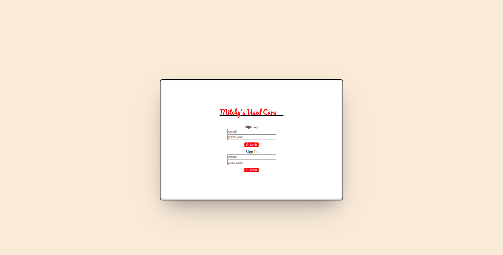
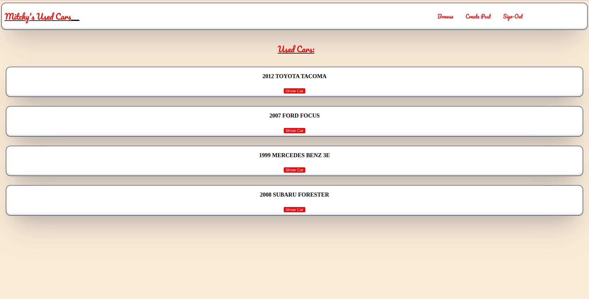
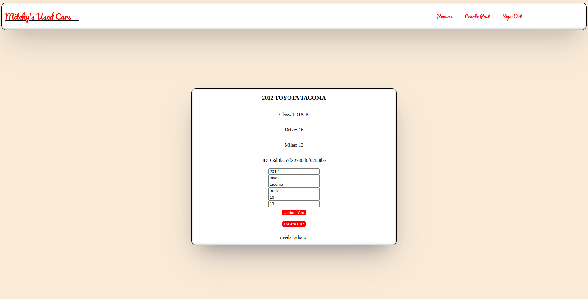
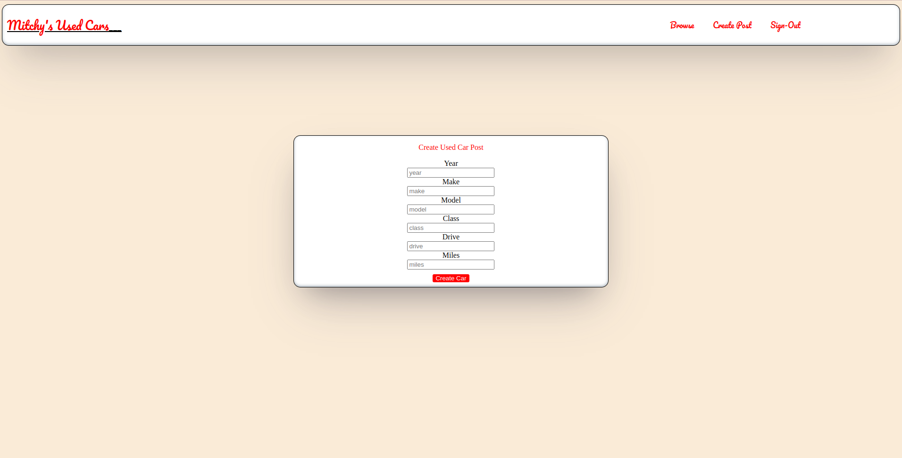
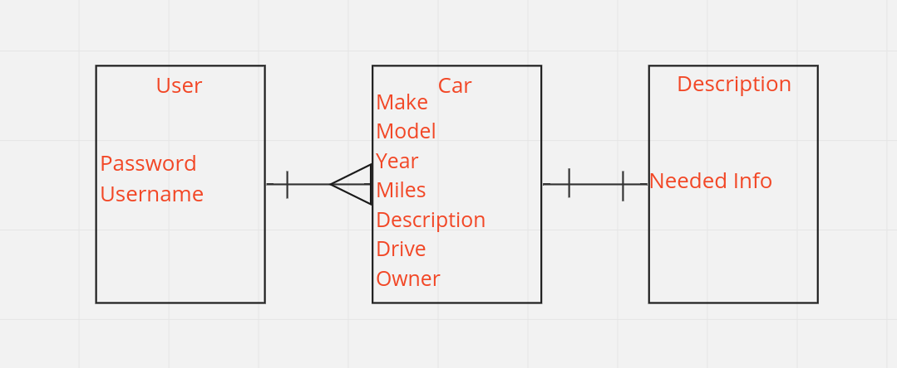

# Mitchy's Used Cars 

## Goal

> To have a internally generating app where a User can go to reliably sell their used cars.

## Wire Frame

## E.R.D.(Entity Relationship Diagram )

## Technologies Use

1. HTML
2. Javascript
3. CSS
4. Node.js
5. NPM
6. Bcrypt
7. Passport/Passport-jwt
8. CORS
9. MIRO
10. Mongoose
11. MongoDB
12. JSONWENTOKEN
13. Express

## User Story V2

1. As a user I would like to add images of used cars for verification 
2. As a user I would like to change my account password for protection
3. As a user I would like to update account informatin like email and username

## User Story V3 
 1. As a user I would like to have a fully Intergrated chat system
 2. As a user I would like to sort what Im browsing by location 
 3. As a user I would like to filter what I browse by price and other identifiers

